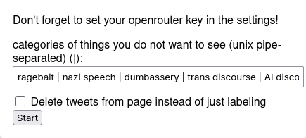

# unfuck-twitter
The repo for my "unfuck twitter" project

[Read the blogpost here](https://substack.com/@ceselder/p-177968908)

## Usage
* Clone the repo
* [Load a temporary extension](https://extensionworkshop.com/documentation/develop/temporary-installation-in-firefox/) and select the manifest file
* In extension settings, add your openrouter key
* Open twitter, open the extension window and add your banned categories as such:

* Click start and start scrolling (optional: don't scroll twitter)